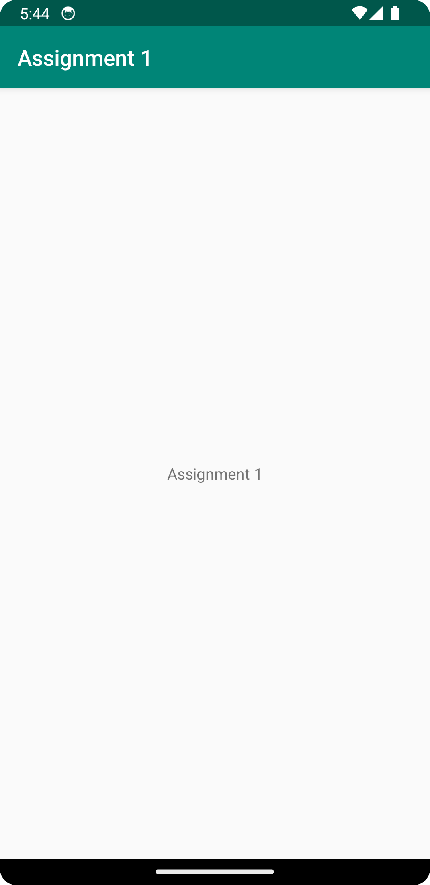

# Rapport

**Skriv din rapport här!**
Denna inlämning gick ut på att kunna hitta och ändra texten "hello world"
Filen man skulle ändra i var strings.xml där man ska ändra variabeln "app_namn" där jag sedan ändrade till "hello world!" till asignment 1. 
variabeln "app_namn" sparar sedan detta ändringar och man kan sedan dom ändringarna i bilden jag skickade nedan.

Bilder läggs i samma mapp som markdown-filen.

